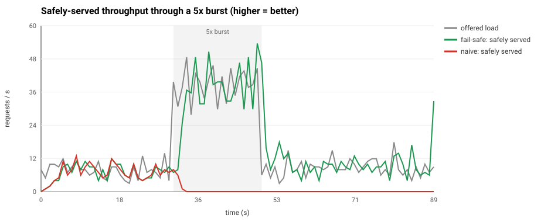
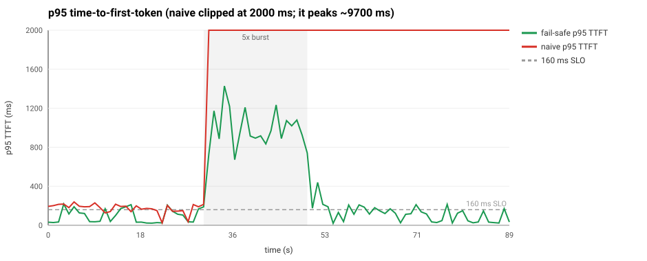
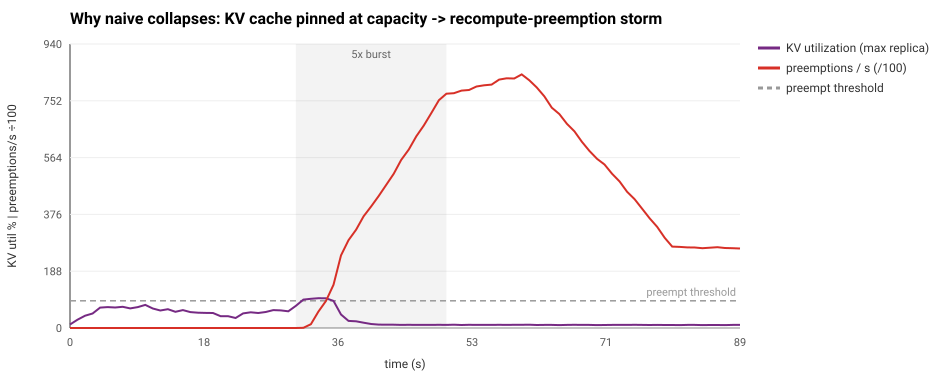
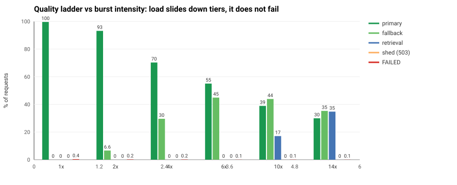
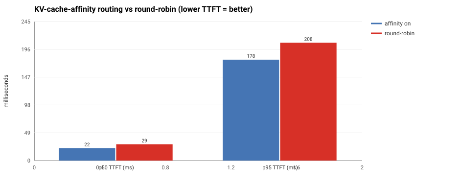

# Fail-safe, low-latency LLM serving — a reliability engineering study

*Independent engineering design study written as part of a job application; not affiliated with or endorsed by Baseten.*

**A reliable, low-latency inference-backed query path that fails *safe* when a GPU
node saturates its KV cache.** It models a high-traffic medical-RAG workload (long
shared retrieval prefixes, a conductor→specialist ensemble, a ~160 ms responsiveness
target) and maps every mechanism to public Baseten documentation — backed by a
runnable, **dependency-free** simulator that reproduces the failure and demonstrates
the fix.

*Inspired by public discussions of large-scale medical-AI systems and public Baseten
documentation. This is an engineering study, not a reconstruction of any specific
production system.*

> **Thesis:** bound every queue, cap concurrency at the *latency knee* (not max
> throughput), shed early with deadline-awareness, route for prefix-cache affinity,
> and always keep a cheaper degraded path — so a saturating node loses **quality**
> gracefully instead of collapsing.

```bash
make all      # runs the tests, then regenerates every chart below. No pip install — stdlib only.
```

---

## The result, in one chart

The same 5× burst hits a naive path and the fail-safe path. *Safely-served
throughput:* the naive path flatlines at the burst and **never recovers**
(metastable collapse); the fail-safe path tracks demand and snaps back.





| through a 5× burst | **fail-safe** | **naive** |
|---|--:|--:|
| safely served | **99.9%** | 6.5% |
| goodput (safe **and** ≤160 ms) | **76.7%** | 4.8% |
| FAILED (timeout / dropped) | **0.1%** | 93.5% |
| KV-cache preemptions | **0** | 2,948,976 |
| client retries (storm) | **0** | 2,011 |
| p95 TTFT — calm / recovery | **187 / 215 ms** | 6,995 / 9,710 ms |

The naive path doesn't just degrade — it falls into a **self-sustaining collapse**:
even after the burst is gone (the recovery window), its goodput stays at **0%** and
p95 TTFT stays at **~9.7 s**, because a retry storm and a pinned KV cache keep
feeding the fire. The fail-safe path is back to **100% full-quality at 215 ms p95**
the moment the burst ends.

---

## A bug I found and fixed (the honest part)

My *first* admission controller used an AIMD loop keyed on **latency**. It looked
reasonable and it was wrong. During the burst it throttled to its floor — and
because that floor sat *below* baseline demand, the queue never drained, so the
"healthy, probe back up" condition never fired. It **self-locked** and never
recovered, even after load returned to normal.

I caught it by reading the time series (`effCap` pinned at 4 while load was 8 rps),
diagnosed the root cause — *a latency signal conflates inherent prefill time with
queue overload, and a floor below demand can never satisfy its own recovery test* —
and fixed it two ways: (1) drive AIMD off **queue wait**, not total TTFT; (2) make a
**static cap at the measured knee** the default (it maps 1:1 to `predict_concurrency`),
with AIMD as a bounded opt-in. Full write-up:
[DESIGN.md §8](DESIGN.md#8-a-lesson-the-simulator-surfaced-adaptive-concurrency-can-self-lock).

> Adaptive control on the wrong signal doesn't just underperform — it can manufacture
> the exact metastable failure you built it to prevent.

---

## Why a node collapses (and why the platform can't save you in time)



```
burst → KV utilization crosses ~90% → engine RECOMPUTE-preempts (the "swapping cliff")
      → TTFT/ITL spike → autoscaler waits 60 s then cold-starts in minutes (too slow)
      → at max_replica, requests queue UNBOUNDED → timeouts → RETRIES → more load
      → metastable collapse that persists after the burst is gone
```

Baseten ships excellent KV-aware routing and autoscaling — but the autoscaler
**re-evaluates only once per 60 s window** and a large model **cold-starts in
minutes**, and the documented behavior at the ceiling is *"requests queue rather
than triggering new replicas."* A clinical burst peaks in seconds. **That gap is
what this design owns.** (Sources in [DESIGN.md](DESIGN.md#10-sources).)

---

## The query path

```
clinician ── SSE stream
   │
[edge]      authn · per-tenant token-bucket · stamp DEADLINE · classify interactive|async
   │
[CONDUCTOR / router]   ← Baseten Chains entrypoint Chainlet
   │   admit ≤ the latency KNEE (predict_concurrency)      ← the one knob that matters most
   │   bounded, DEADLINE-AWARE queue → shed fast (503 + Retry-After + jitter)
   │   prefix-cache-affinity routing (KV reuse) + power-of-two-choices when a replica is hot
   │   per-replica circuit breaker · retry budget ≤10% · hedge only with slack
   │
   ├─► PRIMARY specialists   TRT-LLM/vLLM · min_replica≥2 · FP8 KV · paged + chunked prefill
   ├─► FALLBACK pool         smaller/quantized model — faster, cheaper, scales independently
   └─► SAFE DEGRADE          retrieval-only ranked citations · cached answer · honest 503
```

Each mechanism maps 1:1 to a real Baseten knob (`predict_concurrency`,
`concurrency_target`, `min_replica`, `autoscaling_window`, Chains `RPCOptions`,
`async_predict` priorities, the `trt_llm` KV/quant/prefill fields). The full table
with citations is in **[BASETEN_MAPPING.md](BASETEN_MAPPING.md)**; the reasoning is in **[DESIGN.md](DESIGN.md)**.

### Degrade quality, never safety

The fallback ladder is the *clinical* core. As load climbs 1×→14×, requests slide
**down quality tiers** — full ensemble → small model → ranked sources — while
**FAILED stays ~0.1% and hard-shed (503) stays 0%**. Because the retrieval-only
floor is cheap and grounded, the system essentially never has to reject a clinician
or emit an ungrounded answer.



> **Invariant: never emit an ungrounded/hallucinated answer to make an SLO.** Every
> degraded state is either grounded or honestly empty. *In medicine, that's what
> "fail safe" means.*

---

## The prefix-cache lever

Medical-RAG prompts are long and heavily shared (one system prompt + retrieved
NEJM/JAMA passages). Routing same-prefix requests to the same replica maximizes KV
reuse — cooperating with Baseten's NVIDIA-Dynamo KV-aware router (which reported
**89% cache hit, −50% TTFT** on long context). Isolated in the simulator:



| steady load, cache-pressure regime | affinity | round-robin |
|---|--:|--:|
| prefix cache hit | **90.3%** | 66.8% |
| p50 TTFT | **22 ms** | 29 ms |
| goodput (safe & ≤160 ms) | **91.2%** | 74.4% |

---

## Run it

```bash
make all        # tests + all charts          (python3, standard library only)
make test       # behavioral tests that pin every number in this README
make demo       # regenerate the charts in plots/
python3 experiments/run_collapse_vs_failsafe.py   # the headline experiment
```

## Layout

```
sim/                core simulator (stdlib only)
  config.py           every tunable knob, mapped to its concrete Baseten field
  workload.py         Zipf-popular topics, long shared prefixes, a cold drug-recall burst
  model_node.py       a GPU replica: continuous batching, KV limit, recompute-preemption cliff
  router.py           admission control, deadline queue, prefix-affinity, breaker, fallback ladder
  engine.py           the closed loop (incl. the client retry storm that drives metastability)
  metrics.py          goodput-first metrics + windowed (calm/spike/recovery) summaries
  plotting.py         hand-rolled SVG charts (so there are zero dependencies)
experiments/        three runnable studies -> plots/*.svg
baseten/            deployable shape: Truss config.yaml, model.py, Chains router  (see baseten/README.md)
tests/              7 behavioral tests; `python3 tests/test_sim.py`
DESIGN.md           the full design + failure analysis + sources
BASETEN_MAPPING.md  mechanism -> exact Baseten field, with citations
```

## Honesty about the model

The simulator argues about **systems dynamics**, not model accuracy. It *models*
continuous-batching decode (step-time grows with batch — the throughput↔latency
feedback), KV cache as the real concurrency limit, recompute preemption + the
swapping cliff, prefix-cache reuse, admission control, deadline-aware shedding,
prefix-affinity routing, circuit breaking, the fallback ladder, and the client
retry storm. It *abstracts* the real attention kernel, exact scheduler internals,
network latency, and the conductor's content routing. The constants are plausible,
not measured from a specific GPU — the **shapes** (collapse vs. graceful
degradation; metastability vs. instant recovery) are the point, and they're robust
to the constants. One genuine bug the sim surfaced — an AIMD controller that
self-locks below baseline demand — is documented in [DESIGN.md §8](DESIGN.md#8-a-lesson-the-simulator-surfaced-adaptive-concurrency-can-self-lock)
because the failure mode is instructive.

---

*A reliability-engineering study of fail-safe LLM serving. The workload is modeled
on publicly-described large-scale medical-AI systems; all external claims are cited
in [DESIGN.md](DESIGN.md) and [BASETEN_MAPPING.md](BASETEN_MAPPING.md).*

## License

Apache-2.0 — see [LICENSE](LICENSE).
